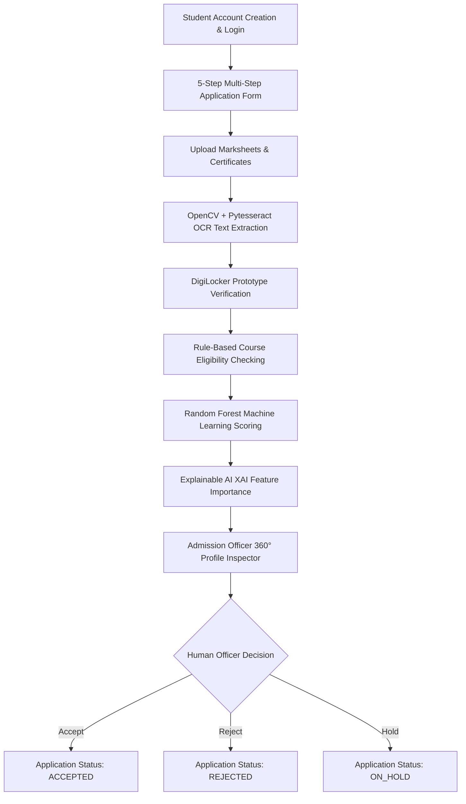

# Intelligent Student Admission Recommendation System — Comprehensive Project Description

## 📌 Project Overview

The **Intelligent Student Admission Recommendation System** is an end-to-end AI-powered university admission decision-support web platform. It automates candidate intake, academic transcript verification, document Optical Character Recognition (OCR), rule-based course eligibility evaluation, and machine learning suitability scoring with Explainable AI (XAI). 

The platform is designed around the **Human-in-the-Loop (HITL)** principle: **AI recommends, humans decide.** The machine learning model provides decision-support recommendations, while final admission decisions (Accept, Reject, or Hold) are always recorded by authorized admission officers, with full tracking of human overrides.

---

## 🏗️ System Architecture & Workflow

The system bridges the gap between student applicants and university admission officers through a 7-stage automated pipeline:



---

## 💻 Tech Stack & Framework Rationale

| Layer | Technology | Purpose & Rationale |
| :--- | :--- | :--- |
| **Backend Framework** | Python 3.11 & Flask | Lightweight, modular Python web framework ideal for rapid ML deployment. |
| **Database** | SQLite3 | Embedded zero-configuration SQL engine, perfect for academic demonstrations and local deployment. |
| **Machine Learning** | Scikit-Learn (`RandomForestClassifier`) | Ensemble learning algorithm that handles non-linear feature interactions and provides built-in feature importances. |
| **Data Science Stack** | Pandas, NumPy, Joblib | Data processing, feature scaling (`StandardScaler`), and model artifact serialization. |
| **Document OCR** | OpenCV (`opencv-python-headless`) + Pytesseract | Computer vision image preprocessing (grayscale, noise reduction, thresholding) combined with Tesseract OCR text extraction. |
| **Frontend UI** | HTML5, Modern CSS3, Bootstrap 5 | Glassmorphic responsive dark theme with custom UI cards, modals, and progress bars. |
| **Iconography & Fonts** | FontAwesome 6, Google Inter & Outfit | Professional visual presentation for university branding. |
| **Visual Analytics** | Chart.js 4 | Client-side dynamic bar, doughnut, pie, and funnel chart rendering for AI explainability and admin dashboards. |

---

## 🔍 Detailed Component & Module Breakdown

### 1. Authentication & Access Control (`routes/auth.py`, `models/user.py`)
- **Role-Based Access Control (RBAC)**: Supports two distinct user roles: `student` and `admin` (Admission Officer).
- **Password Security**: Uses `werkzeug.security.generate_password_hash` and `check_password_hash` with PBKDF2 SHA-256 password hashing.
- **Session Protection**: Flask session cookies keep users authenticated. Route decorators (`@student_required`, `@admin_required`) prevent unauthorized access (e.g. students accessing admin portals or officers modifying student draft forms).

### 2. Multi-Step Student Application Wizard (`routes/application.py`, `templates/student/apply.html`)
- **Step 1 — Personal Information**: Full Name, Email, Phone, Date of Birth, Gender, Address, City, State, PIN Code.
- **Step 2 — Academic Information**: Class 10 %, Class 12 %, Mathematics Score, Physics Score, Chemistry Score, Entrance Exam Name (JEE Main / CUET / State CET), Entrance Exam Score, Passing Year, School / Board Name.
- **Step 3 — Course Selection**: Course branches with specific eligibility thresholds:
  - B.Tech Computer Science & Engineering (CSE)
  - B.Tech Information Technology (IT)
  - B.Tech Electronics & Communication (ECE)
  - B.Tech Mechanical Engineering (ME)
  - B.Tech Electrical Engineering (EE)
- **Step 4 — Additional Information**: Olympiads & Achievements, Industry Certifications, Extracurricular Activities, Work Experience, Statement of Purpose (SOP).
- **Step 5 — Review & Submit**: Client-side validated preview summary. Upon submission, generates a unique application ID (e.g., `APP-2026-00124`).

### 3. Document Management & OCR Processing (`services/ocr_service.py`, `routes/documents.py`)
- **Required Document Checklist**: Class 10 Marksheet, Class 12 Marksheet, Entrance Scorecard, Identity Proof (Aadhaar/Passport), Passport Photograph.
- **Supported Formats & File Limits**: PDF, JPG, JPEG, PNG up to 16MB stored in `uploads/`.
- **OpenCV & Pytesseract Pipeline**:
  1. Image loading via OpenCV (`cv2.imread`).
  2. Conversion to Grayscale (`cv2.COLOR_BGR2GRAY`).
  3. Gaussian Noise Reduction Blur (`cv2.GaussianBlur`).
  4. Otsu Binarization Thresholding (`cv2.threshold`).
  5. Text Extraction using Pytesseract (`pytesseract.image_to_string`).
  6. Text comparison against submitted academic marks (Name match, aggregate percentage match, roll number format validation).
- **Graceful Fallback Mode**: If Tesseract is not installed on the system PATH, the service automatically catches the exception and switches to **Demo OCR Simulation Mode**, generating structured extracted text without crashing the application.
- **DigiLocker Prototype Simulation**: AJAX button simulating real-time government depository connection, updating document status to `DIGILOCKER VERIFIED`.

### 4. Rule-Based Eligibility Engine (`services/eligibility_engine.py`, `routes/eligibility.py`)
Deterministic pass/fail rule checking based on selected engineering branch:
- **B.Tech CSE Criteria**: Class 12 % ≥ 60%, Math ≥ 60, Physics ≥ 55, Chemistry ≥ 50, Entrance Score ≥ 70.
- **B.Tech IT Criteria**: Class 12 % ≥ 60%, Math ≥ 55, Physics ≥ 50, Chemistry ≥ 50, Entrance Score ≥ 65.
- **B.Tech ECE Criteria**: Class 12 % ≥ 55%, Math ≥ 55, Physics ≥ 50, Chemistry ≥ 50, Entrance Score ≥ 60.
- **B.Tech ME / EE Criteria**: Class 12 % ≥ 55%, Math ≥ 50, Physics ≥ 50, Chemistry ≥ 50, Entrance Score ≥ 55.
- **Output**: Returns an overall `ELIGIBLE` or `NOT ELIGIBLE` status along with a detailed check-by-check breakdown showing student score vs. required threshold.

### 5. Machine Learning & Explainable AI (XAI) (`ml/`, `services/recommendation_engine.py`, `services/explainability.py`)
- **Synthetic Dataset Creation (`ml/dataset_generator.py`)**: Generates 1,000 synthetic student records with correlated features (Class 10/12 scores, subject marks, entrance scores, academic consistency, achievements, certifications, extracurriculars).
- **Random Forest Model Training (`ml/train_model.py`)**: Fits a `RandomForestClassifier` with `StandardScaler` feature scaling. Achieves **~89.0% Accuracy**, **~88.7% Precision**, **~89.0% Recall**, and **~88.2% F1 Score**. Saved as `ml/model.pkl` and `ml/scaler.pkl`.
- **Suitability Score Formulation**: Calculates a weighted score (0–100%) and maps it to recommendation categories:
  - `85% – 100%`: Highly Recommended
  - `70% – 84%`: Recommended
  - `55% – 69%`: Review Required
  - `< 55%`: Low Recommendation
- **Explainable AI (XAI)**: Normalizes Random Forest feature importances into relative percentages for Chart.js rendering and generates human-readable narratives:
  - *Positive Factors*: "+ Strong Class 12 performance (89.0%)", "+ Outstanding Mathematics score (91.0)".
  - *Potential Concerns*: "- Entrance score (62.0) could be stronger for high-demand branches".

### 6. Admission Officer Command Center (`routes/admin.py`, `templates/admin/`)
- **Command Center Dashboard (`/admin/dashboard`)**: Metric widgets displaying total intake, pending reviews, eligible candidates, AI recommended candidates, and decision tallies.
- **Directory & Multi-Filter Table (`/admin/applications`)**: Multi-filtering by course branch, eligibility status, AI recommendation category, application status, and live text search.
- **Applicant 360° Detail View (`/admin/applicant/<id>`)**: Tabbed candidate inspector covering:
  - *Tab 1: Academic Information & Transcripts*
  - *Tab 2: Document Uploads & OCR Audit Logs*
  - *Tab 3: Rule-Based Eligibility Audit*
  - *Tab 4: AI Suitability Score & XAI Feature Importance Chart*
- **Human-in-the-Loop Officer Decision Panel**: Officer selects `Accept`, `Reject`, or `Hold`, records mandatory justification comments, and submits. The system automatically detects and flags **Human Overrides** when the officer's decision differs from the AI recommendation (e.g. AI recommends, Officer puts on hold).
- **Visual Analytics Page (`/admin/analytics`)**: Interactive Chart.js graphs displaying Applications by Course, Eligibility Distribution, AI Suitability Breakdown, and Application Processing Funnel.
- **AI Model Transparency Page (`/admin/model-metrics`)**: Displays dataset size, model accuracy, precision, recall, F1 score, global feature importances, and mandatory synthetic data disclaimers.

---

## 🗄️ Database Schema & Entity Relationships

The relational database schema is stored in `database/schema.sql` and `database/admission_system.db`:

```sql
users (id, full_name, email, password_hash, role, phone, dob, created_at)
  │
  ├──< applications (id, student_id, application_number, course, status, submitted_at, updated_at)
        │
        ├──1 academic_info (id, application_id, class10_percentage, class12_percentage, mathematics, physics, chemistry, entrance_exam, entrance_score, passing_year, school_board, achievements, certifications, extracurricular, work_experience, sop)
        │
        ├──< documents (id, application_id, document_type, file_path, file_name, ocr_text, verification_status, verification_message, is_digilocker, uploaded_at)
        │
        ├──1 eligibility_results (id, application_id, is_eligible, summary_json, checked_at)
        │
        ├──1 ai_recommendations (id, application_id, suitability_score, recommendation, feature_importance_json, explanation_json, model_version, created_at)
        │
        └──1 officer_decisions (id, application_id, officer_id, decision, comments, is_override, decision_date)
```

---

## 🧪 Testing, Seeding & Demonstration Workflow

### Pre-Populated Synthetic Demo Data (`seed_data.py`)
Running `python seed_data.py` populates the database with:
- **Admin Account**: `admin@university.edu` / `admin123`
- **Student Demo Account**: `soumya@example.com` / `student123` (B.Tech CSE, 89% Class 12, 91 Math, 82 Entrance Score, 87% AI Suitability Score - Highly Recommended)
- **24 Additional Applicants**: Realistic mixture of Strong, Average, Borderline, and Ineligible candidate profiles.

### End-to-End Demo Workflow Verification
1. **Student Flow**:
   - Register -> Log In -> Fill 5-Step Form (B.Tech CSE) -> Upload Marksheet -> OpenCV OCR Runs -> DigiLocker Prototype Verifies -> Rule Eligibility PASSED -> AI Score Generated (87% Highly Recommended).
2. **Admission Officer Flow**:
   - Log In (`admin@university.edu`) -> Command Center -> Filter Applications -> Open Candidate 360° Profile -> Inspect OCR & XAI Charts -> Submit Decision: **ACCEPT** with remarks -> Status updates to **ACCEPTED**.

---

## 🚀 How to Run the Project

1. **Install Dependencies**:
   ```bash
   pip install -r requirements.txt
   ```
2. **Train Model & Seed Database**:
   ```bash
   python ml/train_model.py
   python seed_data.py
   ```
3. **Start Application**:
   ```bash
   python app.py
   ```
4. **Access Web Portal**:
   Navigate to `http://127.0.0.1:5000` in any web browser.

---

## ⚠️ Academic Disclaimer

> **Synthetic AI Training Data Disclaimer**: This machine learning model is trained using synthetic demonstration data (1,000 records). Its predictions are intended strictly for academic demonstration and decision-support modeling, and should not be used for real-world university admission decisions.
